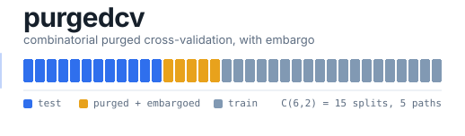

<div align="center">



<br>

[](https://github.com/landtml/purgedcv/actions/workflows/ci.yml)
[](https://github.com/landtml/purgedcv)
[](LICENSE)
[](PROOF.md)

**Cross-validation for time series where the label outlives the bar it sits on.**

</div>

Combinatorial Purged Cross-Validation (CPCV) with embargo, for time series
where the standard train/test split leaks information across the boundary.
Implements the scheme from Marcos Lopez de Prado's
[*Advances in Financial Machine Learning*](https://www.wiley.com/en-us/Advances+in+Financial+Machine+Learning-p-9781119482086)
(AFML), Chapter 7, as a drop-in [scikit-learn](https://scikit-learn.org/)
cross-validator.

```python
from sklearn.model_selection import cross_val_score
from sklearn.linear_model import Ridge
from purgedcv import CombinatorialPurgedCV

cv = CombinatorialPurgedCV(n_groups=6, n_test_groups=2, embargo_pct=0.01)
scores = cross_val_score(Ridge(), X, y, cv=cv)
```

`cv` is accepted by `cross_val_score`, `cross_validate`, `GridSearchCV`,
`RandomizedSearchCV`, `learning_curve` and `permutation_test_score`, including
with `n_jobs > 1`. No other code changes required.

`cross_val_predict` is the one exception, and it cannot be supported: it
requires the test folds to partition the sample, while CPCV's folds overlap by
construction -- each observation is tested in `C(N-1, k-1)` simulations, which is
what produces the multiple backtest paths. Use
[`build_paths`](#usage) to assemble out-of-sample predictions instead.

## The problem this solves

A financial label rarely resolves at the bar it's assigned to. A 21-day
forward-return label observed on Monday only becomes known 21 trading days
later. Standard k-fold or a plain time-series split ignores this: whenever a
training observation's label window overlaps a test observation's, the model
sees future information during training, and that information inflates the
reported cross-validation score above what production would ever deliver.
It is a common reason a backtest looks profitable in validation and falls
apart live.

CPCV addresses this two ways. **Purging** removes any training observation
whose label window overlaps a test window. **Embargo** additionally removes
a buffer immediately after each test block: financial series are serially
correlated, so a training point just past a test boundary can still carry
leaked signal even once the direct label overlap is gone. Testing every
combination of held-out groups, instead of one held-out block at a time,
gives more test paths from the same data while keeping each training set
closer to full size than a single expanding-window split would.

## What's actually being claimed here

CPCV is a published method. This project did not invent it. The value here
is a fast, independently verified implementation:

- **A proof of the purge logic**: [PROOF.md](PROOF.md) states the no-leakage
  property as two theorems and proves them from the interval-overlap
  definition of leakage. The guarantee is about the split boundary, given the
  `t1` you supply -- see [Scope](#scope) for what it does not cover.
- **An independent empirical check of that proof against real data**:
  `verify_leakage.py` downloads decades of market history across 20
  datasets and checks the no-leakage property two different ways. One check
  uses the fast envelope shortcut the proof licenses. The other is a
  brute-force per-observation scan that never uses that shortcut. Both
  agree on every one of 70,000+ splits.
- **A vectorized implementation**: purge and embargo reduce to a handful of
  boolean array operations per split instead of a nested loop. The splitter
  is stateless and picklable, so fitting a model across every combinatorial
  split parallelizes with `joblib` or `n_jobs > 1` (covered by the test suite).
- **A design that structurally avoids a known implementation bug.** Several
  CPCV write-ups online compute the combinatorial backtest paths by reusing
  model predictions across paths, which silently double-counts overlapping
  returns and inflates the reported result. This implementation separates
  the splitter and path map from any return calculation
  (`CPCVPaths.combine`/`.to_frame` do a pure index gather, never a return
  computation). That separation is what makes the double-counting mistake
  structurally impossible here, instead of merely a rule to remember.

## Install

```bash
pip install -e .          # core library
pip install -e ".[dev]"   # + pytest, to run the test suite
pip install -e ".[verify]" # + yfinance, to run verify_leakage.py
```

Core dependencies are `numpy`, `pandas`, and `scikit-learn`. The library
itself never imports `yfinance`; it's needed only for the optional live-data
verification script below.

## Usage

```python
import pandas as pd
from purgedcv import CombinatorialPurgedCV, make_t1

# X.index is a sorted, unique DatetimeIndex; y is your target.
t1 = make_t1(X.index, horizon=21)  # each label resolves 21 bars later

cv = CombinatorialPurgedCV(n_groups=6, n_test_groups=2, embargo_pct=0.01, t1=t1)
for train_idx, test_idx in cv.split(X):
    model.fit(X.iloc[train_idx], y.iloc[train_idx])
    preds = model.predict(X.iloc[test_idx])
```

To assemble the full set of out-of-sample backtest paths, instead of
inspecting folds individually:

```python
paths = cv.build_paths(X, t1=t1)
# per_sim_preds has shape (n_samples, n_sims): one column per combinatorial split.
path_returns = paths.to_frame(per_sim_preds)  # (n_samples, n_paths), index-aligned
```

See the docstrings in [`src/purgedcv/_splitter.py`](src/purgedcv/_splitter.py)
for the full parameter reference, including the two supported embargo-anchor
conventions and their tradeoffs.

### Two things the splitter refuses to do

**Reuse a `t1` built for a different sample.** Purging happens in positional
space, so resolving a `t1` against an index it wasn't built for silently
rescales every label horizon -- a 21-bar label over a halved index spans about
10 positions, and purging then removes far less than it should. Resampling `X`
or dropping rows after building `t1` is enough to trigger it, so a `t1` whose
timestamps fall between `X.index` entries is rejected:

```python
t1 = make_t1(X.index, 21)
cv = CombinatorialPurgedCV(6, 2, t1=t1)
cv.split(X.iloc[::2])
# ValueError: t1 was built for a denser sample than X: 199 of its timestamps
# fall between X.index entries ...
```

Rebuild it for the data you are actually splitting: `make_t1(X_sub.index, 21)`.
Contiguous slices and a `t1` covering a longer history are fine -- both resolve
identically to a rebuilt one.

**Emit a fold with no training data.** A long horizon, a large embargo or a
short sample can purge the entire training set. Such a fold is not a
simulation, and passed to scikit-learn it becomes a `NaN` score that
`np.nanmean` will happily average away. `split` raises instead, naming the
combination and the parameters responsible:

```python
CombinatorialPurgedCV(6, 2, embargo_pct=0.01).split(X, t1=make_t1(X.index, 21))
# ValueError: split with test groups (1, 4) retains 0 training observation(s)
# after purge and embargo ... n_samples=126, longest label horizon=21 bars
```

Pass `min_train_size=0` to allow them, or raise it above 1 to require a
minimum viable training set.

## Verifying the claims yourself

```bash
pytest                    # 115 tests, 14 of them against a real sklearn install
python verify_leakage.py  # requires network + `pip install -e ".[verify]"`
```

`verify_leakage.py` prints a certificate summarizing what it checked. A
recent run, abridged (the full block also reports scenario and
purge-equivalence counts):

```
======================================================================
PURGEDCV LEAKAGE VERIFICATION CERTIFICATE
======================================================================
  datasets verified      : 20 tickers
  calendar span          : 1927-12-30 -> 2026-05-19
  total bars (obs)        : 191,160
  train/test splits       : 70,080
  envelope assertions     : 977,027,536
  brute-force pair checks : 107,693,946,180
----------------------------------------------------------------------
  RESULT: PASS
  Zero leakage detected across every split, scenario, and dataset.
======================================================================
```

Full methodology, the proof the certificate is checking, and the scope/limits
of the guarantee are in [PROOF.md](PROOF.md).

## Scope

This library produces splits and a path map. It deliberately does not
compute returns, P&L, or performance metrics. That belongs to whatever
backtest engine consumes its output, and keeping it out is what makes the
overlapping-return bug described above structurally impossible instead of
merely avoided by convention. It also does not detect leakage inside your
own feature engineering, such as a feature computed with a forward-looking
window: the no-leakage guarantee covers the split boundary, which is what
this library controls.

## License

MIT. See [LICENSE](LICENSE).
